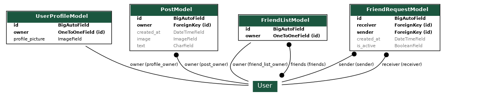

# G-Social
A simple social media platform.  
Trello table: https://trello.com/b/iaBLXGKE/g-social

## Project Overview
G-Social is designed as a comprehensive social media platform.

### Key Infrastructure Elements

- **Django**: A versatile framework that forms the backbone of our web application, known for its ease of use and robustness.
- **Celery**: An asynchronous task queue/job queue based on distributed message passing. Used for handling background tasks.
- **Redis**: Employed as the Celery broker for managing task queues and efficient processing of background tasks.
- **MySQL**: Relational database.
- **Nginx**: A high-performance web server, handling HTTP requests and serving static and media files.
- **RabbitMQ**: Acts as the RPC client, managing Remote Procedure Calls within the system for distributed and asynchronous task execution.

### Django Apps

- **user_app**: Handles user authentication and profile management. For more details, see the [user_app's README file](apps/user_app/README.md).
- **post_app**: Handles post management. For more details, see the [post_app's README file](apps/post_app/README.md)
- **friend_app**: Handles friend management.  For more details, see the [friend_app's README file](apps/friend_app/README.md)

### Database Model Description
The User table is a core component of Django's built-in modules.

## Docker Compose Setup

For production the project uses docker.

### Env file
**Django**
- DEV_SECRET_KEY 
- TEST_SECRET_KEY 
- PROD_SECRET_KEY
- LOG_LEVEL_DEV 
- LOG_LEVEL_TEST
- LOG_LEVEL_PROD
- RABBITMQ_PASS
- DATABASE_NAME 
- DATABASE_USER
- DATABASE_PASSWORD

**RabbitMQ**
- RABBITMQ_DEFAULT_PASS

**Database**
- MYSQL_ROOT_PASSWORD

### Volumes

| Volume          | Purpose                           |
|-----------------|-----------------------------------|
| `mysql_data`     | Persistent data for MySQL        |
| `rabbitmq_data`  | Persistent data for RabbitMQ     |
| `redis_data`     | Persistent data for Redis        |
| `static_volume`  | Stores Django static files       |
| `media_volume`   | Stores Django media files        |